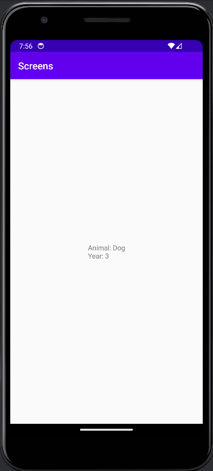

# Rapport


Koden nedanför visar hur data har överförts mellan de två activities. 
Den första där en Intent skapas är i första activity (MainActivity) där även datan som ska visas på den andra activity finns med. 
Den andra raden med "Bundle extras" ligger i den andra activity (DetailsActivity), där datan tas emot och genom att ge de en datatyp hjälper det programmet att veta vad datan innehåller. 
Datan som tas emot visas sedan tillsammans i en string som lägger sig i en textview som finns i den andra activity's layout (activity_details.xml) 

```
Intent intent = new Intent(MainActivity.this, DetailsActivity.class);
intent.putExtra("animal", "Dog"); // Optional
intent.putExtra("year", 3); // Optional
startActivity(intent);

...

Bundle extras = getIntent().getExtras();
if (extras != null) {
    String name = extras.getString("animal");
    int number = extras.getInt("year");

    String detailsText = "Animal: " + name + "\nYear: " + number;
    showData.setText(detailsText);
                
```
Utöver skicka och hämta data mellan activities har även widgets lades in för att kunna starta den andra activity. 
En knapp har blivit tillagd som är kodad i MainActivity till att, från MainActivity gå till DetailsActivity och visa den sidan med data.
För att visa text på DetailsActivity har en textView blivit tillagd.


#### Screenshots
MainActivity:
 

Andra activity:

